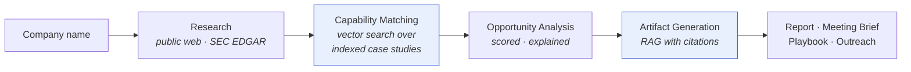
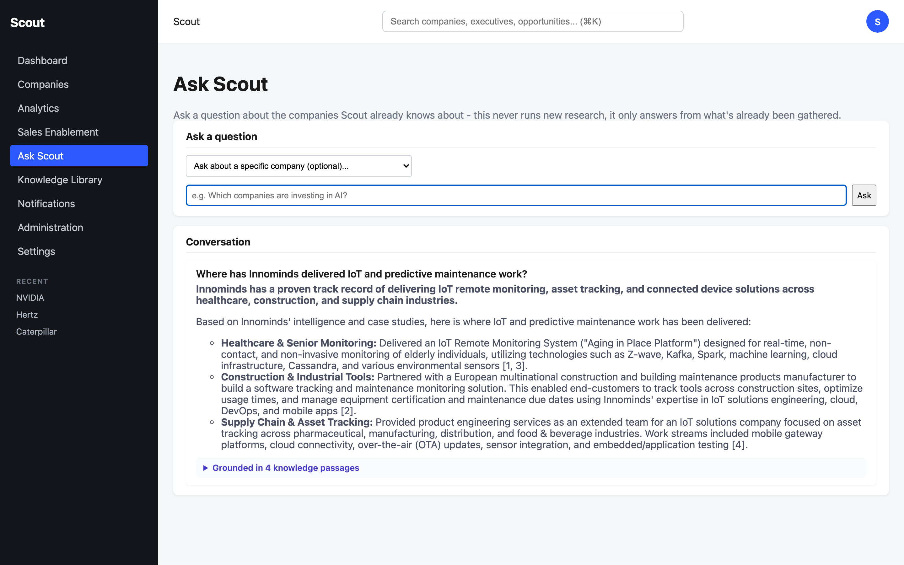
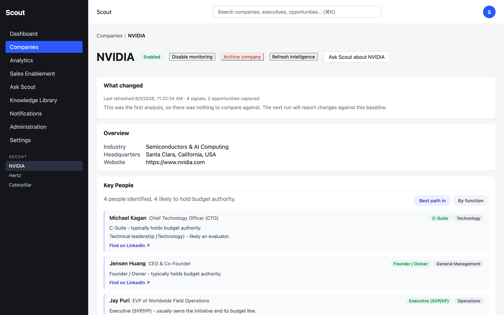
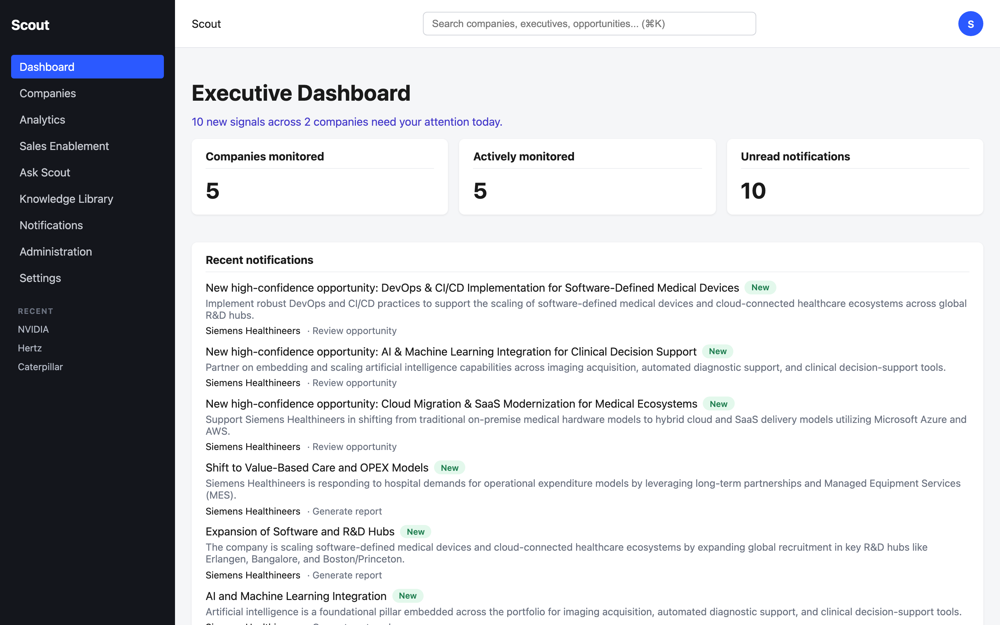
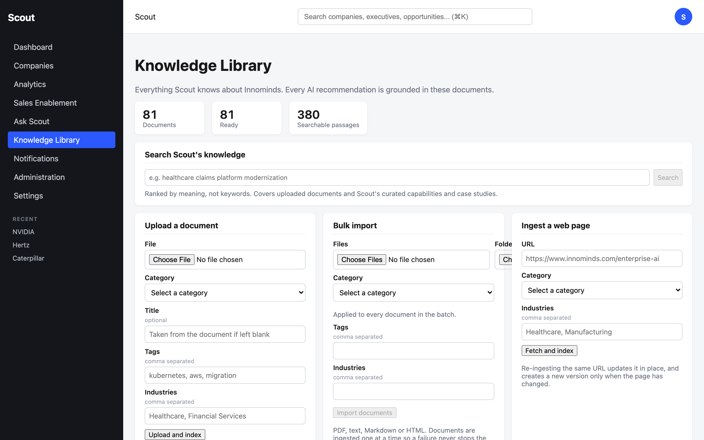
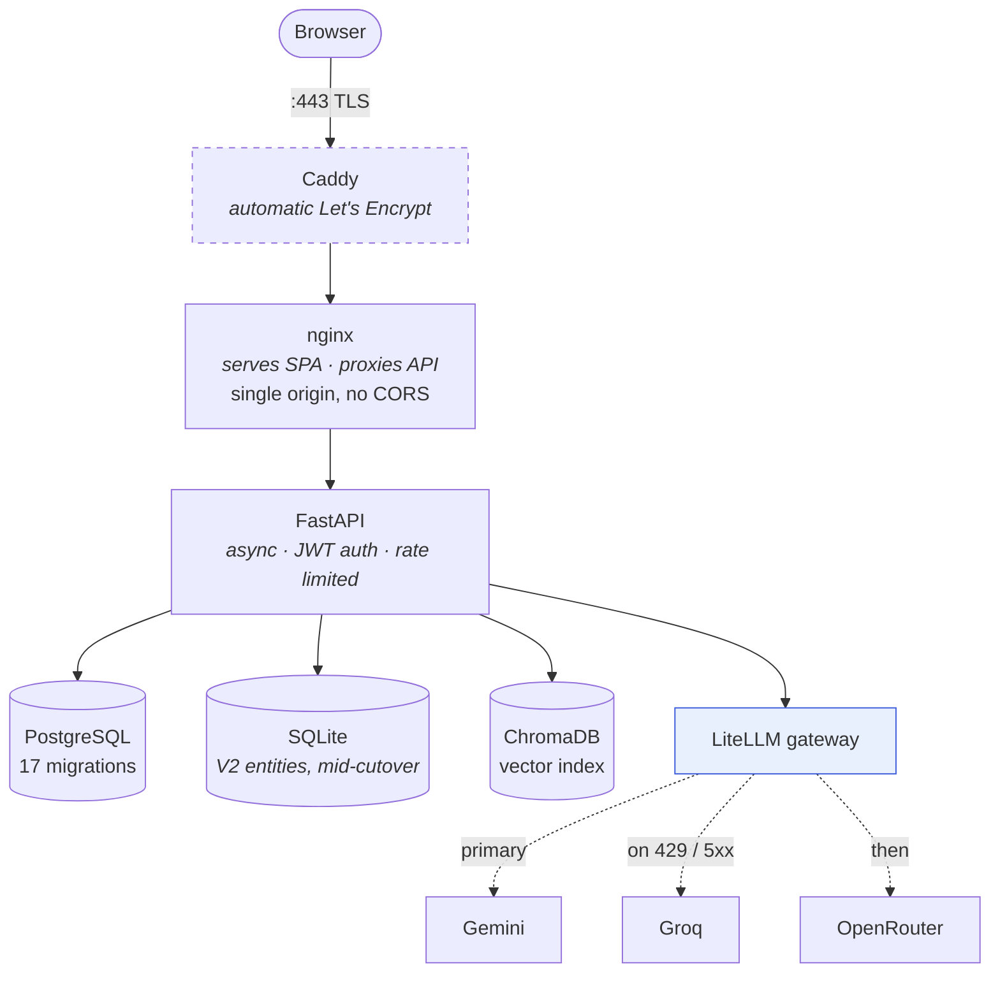

# Scout

[](https://github.com/narenkumararajah1/Scout/actions/workflows/ci.yml)
[](tests/)
[](LICENSE)
[](requirements.txt)
[](frontend/react/package.json)

**An AI sales-intelligence platform that researches companies, finds opportunities, and grounds every recommendation in evidence.**

Scout takes a company name, researches it from public sources, matches what it
finds against a catalogue of your organisation's real delivery capabilities, and
produces the artifacts a salesperson actually uses: an intelligence report, a
meeting brief, a sales playbook, a drafted outreach email.

The distinguishing constraint is **grounding**. Scout does not simply ask a model
what it thinks. Recommendations are retrieved from a vector-indexed corpus of real
case studies, so "we have done this before" is a claim backed by a document rather
than a plausible-sounding sentence.



The two highlighted stages are where grounding happens — everything Scout claims
traces back to an indexed document rather than to model recall.

---

## Screenshots

**Ask Scout** — answers grounded in the indexed case-study corpus, with inline
citations and the retrieved passages shown. This is the whole thesis of the
project in one screen.



**Company Intelligence** — what changed since the last run, key people ranked by
route in, and seniority inferred deterministically from job titles.



<details>
<summary>Executive Dashboard and Knowledge Library</summary>





</details>

---

## What it does

| Capability | Detail |
|---|---|
| **Company research** | Public web + SEC EDGAR, normalised and deduplicated with source attribution |
| **Capability matching** | Semantic search over an indexed catalogue; produces scored opportunities |
| **Knowledge Library** | Bulk PDF/URL ingestion, chunking, versioning, deduplication, RAG retrieval |
| **Artifact generation** | Intelligence reports, meeting briefs, sales playbooks, outreach drafts, PDF export |
| **Change detection** | Snapshots each analysis and reports what changed since the last run |
| **Executive intelligence** | Extracts people, infers seniority deterministically, ranks routes in |
| **Ask Scout** | Conversational Q&A grounded in the knowledge corpus, with citations |

## Architecture



Caddy is dashed because TLS is staged but not yet live — see
[Status and limitations](#status-and-limitations).

Three design decisions worth calling out:

**Multi-provider LLM failover.** A single free-tier rate limit once killed an
entire analysis. `backend/ai/llm_gateway.py` now tries providers in order
(Gemini → Groq → OpenRouter), failing over on provider problems — 429, quota,
timeout, 5xx, rejected key — but *never* on prompt problems like an oversized
context, because every provider would reject those identically.

**Pipeline orchestration.** Analysis is a staged pipeline
(`backend/orchestration/`) where an individual stage can fail without losing the
run. A failed executive-extraction stage costs you executives, not the report.

**Dual-store migration mode.** The V2→V3 database cutover is a runtime setting
(`sqlite` → `dual_write` → `postgres`), so rolling forward or back is one config
change rather than a redeploy.

## Quick start

Requires Docker with Compose v2. Nothing else — Python, Node and nginx all run
inside containers.

```bash
git clone https://github.com/narenkumararajah1/Scout.git
cd Scout
cp .env.example .env      # fill in the values marked required
```

```bash
cd deploy && docker compose up -d --build
```

First boot runs migrations and seeds the capability catalogue automatically.
Then create the single account and open <http://localhost:8080>:

```bash
docker compose exec backend python -m scripts.bootstrap_user --email you@example.com
```

Full runbook, configuration reference, verification checklist and troubleshooting:
[`docs/beta-deployment/`](docs/beta-deployment/).

## Testing

```bash
pytest -q
```

**695 tests.** Integration tests requiring PostgreSQL are gated and skip cleanly
without it. CI runs on every push ([`.github/workflows/ci.yml`](.github/workflows/ci.yml)).

Tests are written to document the defect they prevent. `tests/test_login_rate_limit.py`
and `tests/test_route_authentication.py` are representative — each asserts a
property, and its docstring explains the failure that motivated it.

## Project structure

```
backend/          FastAPI application
  ai/             LLM gateway, prompts, confidence, extraction
  api/            V3 routers, dependencies, error envelope
  orchestration/  staged analysis pipeline
  repositories/   data access, dual-store dispatch
  services/       domain logic
frontend/react/   React 19 + Vite SPA
deploy/           Docker Compose, nginx, Caddy (TLS)
migrations/       Alembic, 17 revisions
scripts/          bootstrap, seeding, data migration
docs/             architecture, design, deployment
tests/            695 tests
```

## Documentation

| | |
|---|---|
| [`docs/v3/`](docs/v3/) | Current architecture, data model, API specification, ADRs |
| [`docs/beta-deployment/`](docs/beta-deployment/) | Install, configure, verify, operate, troubleshoot |
| [`docs/design/`](docs/design/) | UI/UX standards and component library |
| [`TECH_DEBT.md`](TECH_DEBT.md) | Engineering roadmap, known limitations, and the full defect log |

## Status and limitations

Scout is **feature-complete for a single-user internal beta** and deployed on a
cloud VM. Stated plainly, because a portfolio project that hides its edges is
less useful than one that names them:

- **Single shared account.** No per-user identity, roles, or audit trail.
  Multi-user is a deliberate future phase, not an oversight.
- **Single instance.** The scheduler runs in-process, so horizontal scaling
  would need it extracted first.
- **Executive data is inferred** from public sources, not confirmed by the
  companies concerned. The UI says so.
- **Python 3.9** is pinned to match the deployment target and is end-of-life.

All tracked in [`TECH_DEBT.md`](TECH_DEBT.md).

## License

[MIT](LICENSE).
